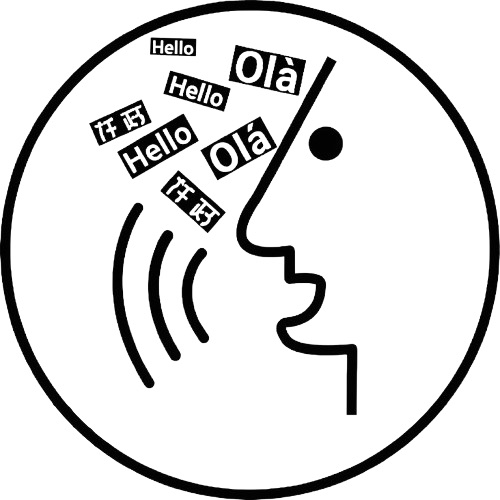

<div style="margin-left: 20px;">
<h1>Whistle</h1>
<p>Whistle is an AI-powered dictation tool built for speed, embracing a minimalist design to streamline your writing through seamless speech-to-text conversion. It integrates effortlessly with macOS, using system-wide hotkeys to keep you focused on your work without switching apps.
</p>
<a href="https://github.com/qibinlou/Whistle/releases"></a>
</div>

<br/><br/>

<div align="center">
<a href="https://github.com/qibinlou/Whistle/releases"></a>
<a href="https://github.com/qibinlou/Whistle/releases"></a>
<a href="https://github.com/qibinlou/Whistle/blob/master/LICENSE"></a>
<a href="https://github.com/qibinlou/Whistle"></a>
</div>

------


🆕 Just upgraded to OpenAI's latest and best transcription model [`gpt-4o-transcribe`](https://openai.com/index/introducing-our-next-generation-audio-models/).


## Features

- **AI-Powered Dictation**: Convert your speech to text quickly and accurately, powered by advanced AI models such as OpenAI's Whisper model and `gpt-4o-transcribe` model
- **System-Wide Hotkeys**: Activate dictation from anywhere with customizable keyboard shortcuts
- **Configurable Settings**:
  - Enable/disable dictation
  - Select from various keyboard shortcuts (F5, Fn+F5, ⌘+F5, ⌥+D, with more options to come)
  - Play dictation sounds
  - Pause music during dictation
- **Small and Lightweight**: Designed to be unobtrusive, Whistle runs in the background and uses minimal system resources. The whole app is less than 50MB.

## How to Use

1. Launch the Whistle application
2. Enter your OpenAI API key in the settings, make sure you have a valid key for the `gpt-4o-transcribe` model and that your billing is set up correctly
3. Configure your preferred keyboard shortcut in Settings and use the configured hotkey to activate dictation
4. You need to approve the microphone access prompt the first time you use it, and accept the macOS accessibility permission to allow Whistle to control your keyboard, so you can stay focused on your tasks
5. Speak clearly, and your words will be converted to text in the active application window

## Configuration

Whistle can be configured through the Settings screen:

- **Enable Dictation**: Turn the dictation feature on or off
- **Dictation Keyboard Shortcut**: Choose from various system-wide hotkeys
- **Play Dictation Sounds**: Toggle audio feedback for dictation events
- **Pause Music During Dictation**: Automatically pause music playback when dictation is active

## Privacy

Bring your own API key for best performance and minimized trust. No logging, no tracking, no data collection.

## Installation

1. Make sure you have Flutter installed (requires SDK version ^3.5.3)
2. Clone this repository
3. Install dependencies:

   ```
   flutter pub get
   ```

4. Run the application:

   ```
   flutter run
   ```

5. Build the application for release (optional):

   ```
   flutter build macos --release
   ```

### Windows or Linux Support

Currently, Whistle is only available for macOS. However, with the Flutter framework, contributions to add support for Windows or Linux are feasible and welcome! If you're interested in helping out, please check the issues and pull requests for more information.

## Authors

* [Leo Lou](https://www.louqibin.me)

## License

MIT
